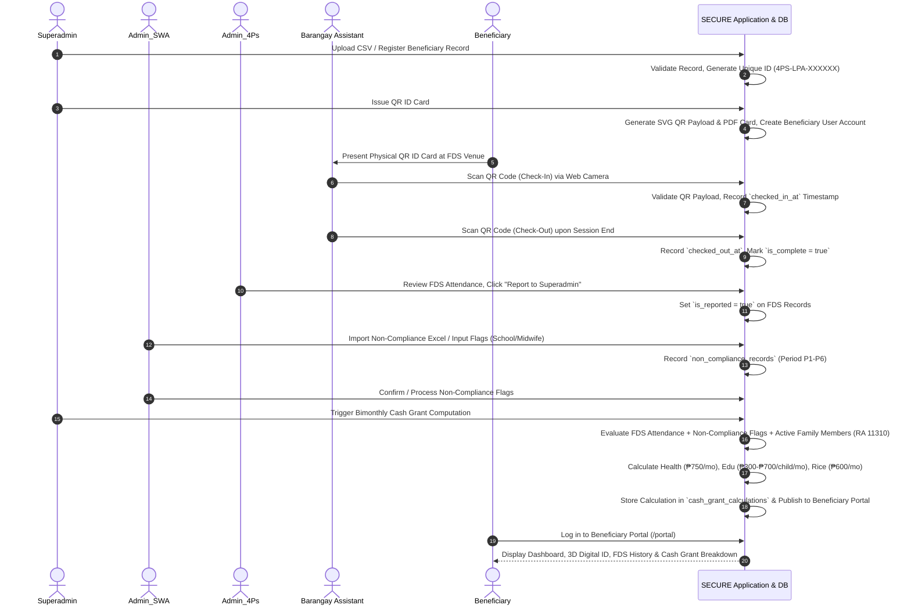
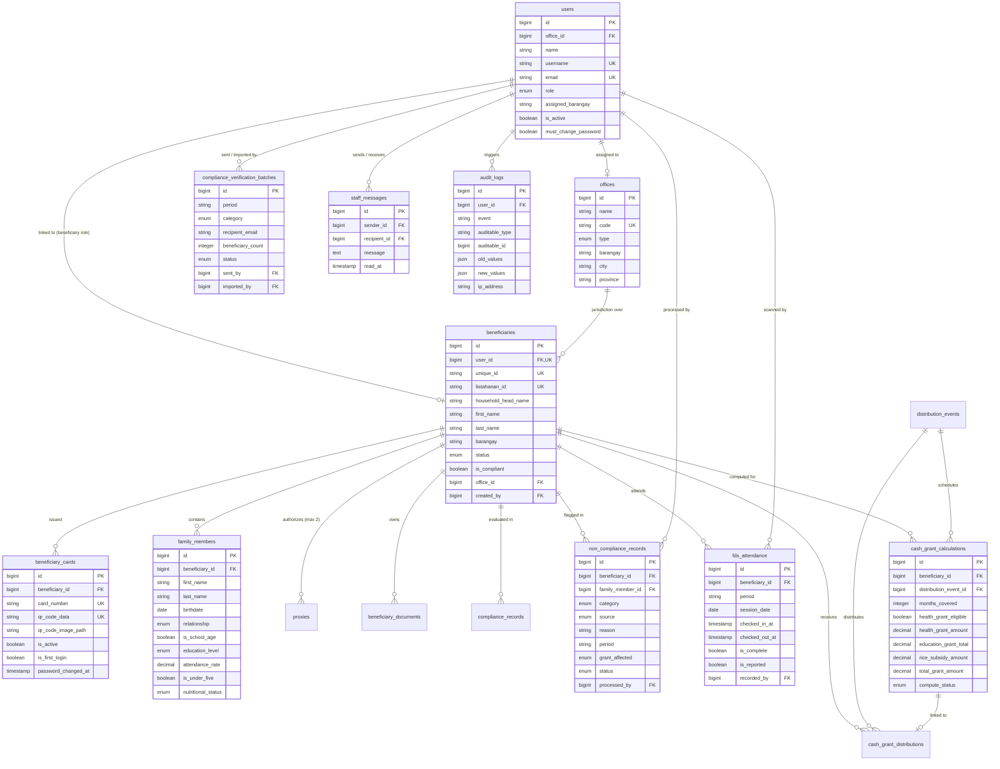
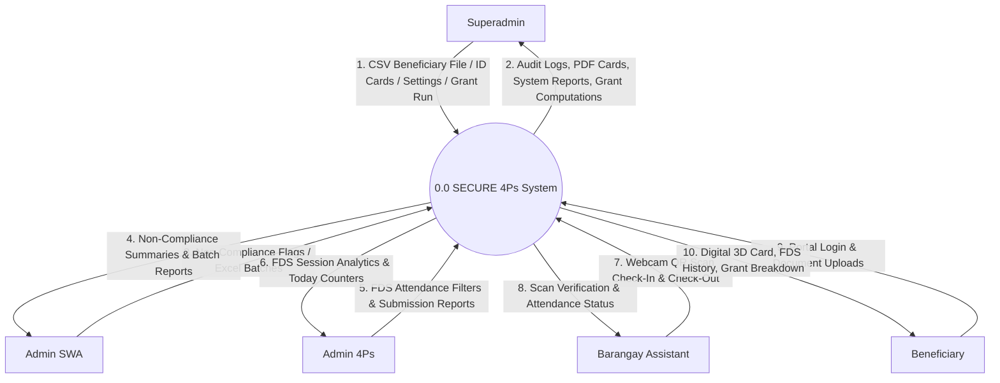
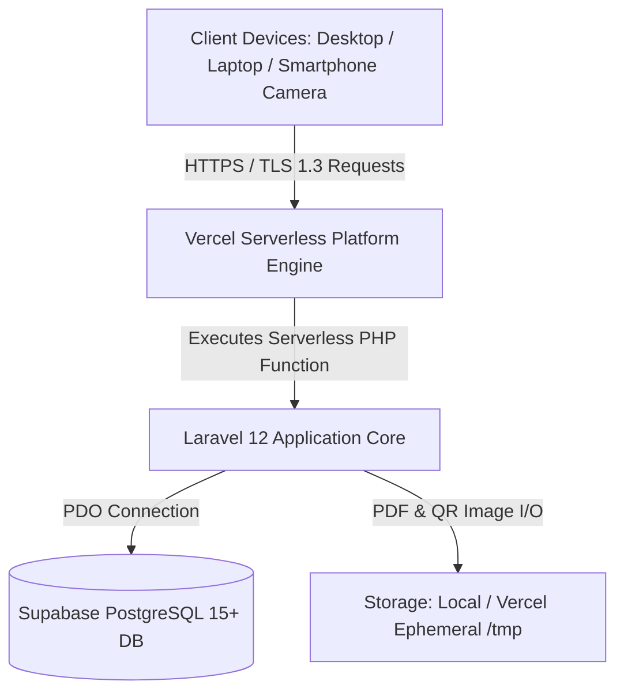

# SECURE: System for Eligibility Checking, Unified Records, and Evaluation — Technical Reference Document

**A Card-Based QR System for the Pantawid Pamilyang Pilipino Program (4Ps)**  
*Lipa City Division, Batangas — DSWD Field Office IV-A CALABARZON*

---

## Document Purpose and Scope
This technical reference document provides an authoritative, code-accurate description of the actual implementation of **SECURE** (System for Eligibility Checking, Unified Records, and Evaluation). This document serves as the technical source of truth for writing Chapter 3 (Methodology), specifically *System Architecture and Design* and *Development Tools and Technologies*.

All specifications, database structures, workflows, role definitions, security controls, and technological dependencies documented herein are derived directly from the active codebase, database migrations, package manifests (`composer.json` and `package.json`), routes, controllers, middleware, and Vue 3 frontend components.

---

# PART A — SYSTEM ARCHITECTURE AND DESIGN

## 1. SYSTEM OVERVIEW

### 1.1 Application Purpose
SECURE is a web-based administrative and beneficiary-facing record management, compliance monitoring, and cash grant computation system designed for the Pantawid Pamilyang Pilipino Program (4Ps) in Lipa City, Batangas. The system digitizes beneficiary identification through physical QR-coded ID cards, automates Family Development Session (FDS) attendance tracking via camera-based QR code scanning (Check-In and Check-Out), processes health and education compliance records, computes bimonthly cash grant totals based on statutory parameters (RA 11310), and publishes transparent grant and compliance summaries to beneficiaries via a dedicated portal.

### 1.2 Explicit System Boundaries
1. **No Independent Eligibility Determination**: SECURE does **NOT** determine official 4Ps program eligibility. Pre-qualified household records are imported into the system from pre-validated government files (e.g., Listahanan / NHTS-PR exports).
2. **No Physical Cash Payout Execution**: SECURE does **NOT** execute or disburse physical cash payouts, handle electronic fund transfers, or operate ATMs/cash distribution points. QR codes are strictly utilized for **beneficiary identification** and **QR-based FDS attendance recording**.
3. **No Direct External Government API Integrations**: SECURE operates as a standalone system. It does **NOT** maintain live API integrations with external government databases (such as CBMS, PhilSys, Listahanan/NHTS-PR, DOH, or DepEd). Data exchange is facilitated exclusively via structured file imports/exports (CSV/Excel).
4. **Supportive Role in DSWD Operations**: Official administrative decisions (such as household delisting, penalty waivers, or grant approvals) remain under the authority of authorized DSWD personnel.

### 1.3 System User Roles
SECURE enforces strict Role-Based Access Control (RBAC) across five distinct user roles:

| Role Identifier | Display Name | Core System Responsibilities & Boundaries |
| :--- | :--- | :--- |
| `superadmin` | System Administrator | System-level administration, beneficiary record creation/importing/activation, sole authorization to issue and generate 3D QR-coded ID cards, cash grant computation execution, audit log inspection, system settings management, maintenance mode control, and full report generation. |
| `admin_swa` | Admin SWA (Social Welfare Assistant) | Education and Health compliance processing, non-compliance intake (school rep & midwife report processing), compliance verification batch generation/import via Excel templates, and grant summary monitoring. |
| `admin_4ps` | Admin 4Ps (Program Officer) | FDS attendance monitoring, aggregation of QR-recorded attendance, session verification, generation of FDS compliance reports for Superadmin review, and internal staff messaging. |
| `barangay_assistant` | Barangay Assistant / FDS Officer | Camera-based QR code scanning for FDS session entry (Check-In) and exit (Check-Out), attendance logging restricted to assigned barangay jurisdiction, and daily check-in counter view. |
| `beneficiary` | Beneficiary Household Head | Self-service beneficiary portal access, viewing digital 3D QR card replica, viewing household/family profile, inspecting Education and Health status, reviewing FDS attendance history, and checking computed bimonthly cash grant breakdowns and compliance remarks. |

### 1.4 Division of Operations

```
┌────────────────────────────────────────────────────────────────────────────────────────┐
│                                 OPERATIONAL BOUNDARIES                                 │
├──────────────────────────┬─────────────────────────────┬───────────────────────────────┤
│ AUTOMATED SYSTEM ACTIONS │ AUTHORIZED USER INPUTS      │ DSWD PERSONNEL DECISIONS      │
├──────────────────────────┼─────────────────────────────┼───────────────────────────────┤
│ • Unique ID generation   │ • CSV/Excel beneficiary     │ • Official 4Ps selection &    │
│   (4PS-LPA-XXXXXX)       │   import data               │   program enrollment          │
│ • QR payload hashing &   │ • Non-compliance flags      │ • Beneficiary document        │
│   SVG QR rendering       │   (school/midwife reasons)  │   verification & activation   │
│ • Bimonthly grant math   │ • FDS QR scanning (entry/   │ • Manual grant adjustment     │
│   (Health, Edu, Rice)    │   exit timestamps)          │   approval                    │
│ • Staff chat unread      │ • System settings &         │ • Household delisting,        │
│   polling & badge counts │   maintenance mode toggles  │   suspension, or graduation   │
│ • Audit log recording    │ • Staff chat messages       │ • Physical cash disbursement  │
└──────────────────────────┴─────────────────────────────┴───────────────────────────────┘
```

---

## 2. USE CASE DIAGRAM

### 2.1 Use Case Specifications

```mermaid
usecaseDiagram
    left to right direction
    actor "Superadmin" as SA
    actor "Admin_SWA" as SWA
    actor "Admin_4Ps" as A4P
    actor "Barangay Assistant" as BA
    actor "Beneficiary" as BEN

    rectangle "SECURE 4Ps System Boundary" {
        usecase "Manage Beneficiary Records" as UC_SA1
        usecase "Import Beneficiaries (CSV)" as UC_SA2
        usecase "Issue & Generate QR ID Cards" as UC_SA3
        usecase "Execute Cash Grant Computation" as UC_SA4
        usecase "Inspect Audit Logs & System Settings" as UC_SA5
        usecase "Toggle Maintenance Mode" as UC_SA6
        usecase "Export System Reports" as UC_SA7

        usecase "Process Non-Compliance Records" as UC_SWA1
        usecase "Manage Compliance Verification Batches" as UC_SWA2
        usecase "Review Health & Education Summaries" as UC_SWA3

        usecase "Monitor FDS Attendance & Sessions" as UC_A4P1
        usecase "Submit FDS Compliance Report to SA" as UC_A4P2

        usecase "Scan QR Code for FDS Check-In" as UC_BA1
        usecase "Scan QR Code for FDS Check-Out" as UC_BA2

        usecase "Access Beneficiary Portal Dashboard" as UC_BEN1
        usecase "View Digital 3D QR ID Card" as UC_BEN2
        usecase "View Household & Family Information" as UC_BEN3
        usecase "View FDS Attendance History" as UC_BEN4
        usecase "View Published Grant Computation" as UC_BEN5
        usecase "Upload Required Documents" as UC_BEN6
        usecase "Change First-Login Password" as UC_BEN7

        usecase "Internal Staff Chat" as UC_CHAT
    }

    SA --> UC_SA1
    SA --> UC_SA2
    SA --> UC_SA3
    SA --> UC_SA4
    SA --> UC_SA5
    SA --> UC_SA6
    SA --> UC_SA7
    SA --> UC_CHAT

    SWA --> UC_SWA1
    SWA --> UC_SWA2
    SWA --> UC_SWA3
    SWA --> UC_CHAT

    A4P --> UC_A4P1
    A4P --> UC_A4P2
    A4P --> UC_CHAT

    BA --> UC_BA1
    BA --> UC_BA2
    BA --> UC_CHAT

    BEN --> UC_BEN1
    BEN --> UC_BEN2
    BEN --> UC_BEN3
    BEN --> UC_BEN4
    BEN --> UC_BEN5
    BEN --> UC_BEN6
    BEN --> UC_BEN7
```

### 2.2 Actor-to-Use-Case Matrix

| Use Case Description | Superadmin | Admin_SWA | Admin_4Ps | Barangay Assistant | Beneficiary |
| :--- | :---: | :---: | :---: | :---: | :---: |
| Manage Household/Beneficiary Records | **X** | | | | |
| Import Beneficiary File (CSV Template) | **X** | | | | |
| Issue & Generate Official QR ID Card | **X** *(Sole Authorized)* | | | | |
| Execute Grant Computation (RA 11310) | **X** | | | | |
| Manage System Settings & Maintenance Mode | **X** | | | | |
| Inspect Audit Trail Logs | **X** | | | | |
| Process Health & Edu Non-Compliance | | **X** | | | |
| Send/Import Compliance Excel Batches | | **X** | | | |
| Monitor & Filter FDS Attendance Data | | | **X** | | |
| Report FDS Compliance to Superadmin | | | **X** | | |
| Scan QR Code for FDS Entry/Exit | | | | **X** | |
| View Portal & 3D Digital ID Card | | | | | **X** |
| View Household, FDS & Grant Summary | | | | | **X** |
| Upload Verification Documents | | | | | **X** |
| Force First-Time Password Change | | | | | **X** |
| Internal Staff Chat Messaging | **X** | **X** | **X** | **X** | |

### 2.3 Role Restrictions Enforced in Source Code
1. **QR Card Generation Restriction**: Enforced in `SuperAdminBeneficiaryController.php` and `BeneficiaryCardService.php`. Only `superadmin` can execute `issueCard()` or `batchIssueCards()`.
2. **Barangay Jurisdiction Restriction**: Enforced in `BarangayAssistant/DashboardController.php` and `FdsAttendanceController.php`. Barangay Assistants can only view and scan attendance within their `assigned_barangay`.
3. **Superadmin Staff Chat Restriction**: Enforced in `StaffChatController.php`. Superadmin can chat with `admin_swa` and `admin_4ps`, while Barangay Assistants cannot initiate direct chat messages to Superadmin.
4. **Maintenance Mode Lockout**: Enforced in `CheckMaintenanceMode.php`. When `maintenance_mode = 1`, all non-superadmin routes return a 503 Maintenance page.

---

## 3. SWIMLANE DIAGRAM

### 3.1 PlantUML / Mermaid Specification



### 3.2 Detailed Step-by-Step Workflow Explanation
1. **Beneficiary Onboarding & ID Card Issuance**: Superadmin imports pre-qualified household records via CSV (`BeneficiaryImportController.php`). The system generates a unique identifier (`4PS-LPA-XXXXXX`), sets up an inactive portal account, and creates household entries. Superadmin approves documents and issues the QR-coded physical ID card (`BeneficiaryCardService.php`).
2. **FDS QR Check-In & Check-Out Scanning**: Beneficiaries attend local FDS sessions in their respective barangays. The Barangay Assistant scans the card QR code using the web scanner (`html5-qrcode`). The system records the entry time (`checked_in_at`). Upon session completion, a second scan logs the exit time (`checked_out_at`) and marks the attendance as complete (`is_complete = true`).
3. **FDS Attendance Aggregation**: Admin 4Ps monitors live session attendance, filters by barangay/date, and executes `reportToSuperadmin()`, marking the batch as reported (`is_reported = true`).
4. **Health & Education Non-Compliance Intake**: School Representatives and Midwives report attendance/health shortfalls to Admin SWA. Admin SWA inputs or imports these exceptions (`non_compliance_records`), flagging specific children or pregnant women for the relevant bimonthly period.
5. **Consolidated Compliance & Cash Grant Computation**: Superadmin initiates grant calculation for the active bimonthly distribution event (`GrantComputationController.php` / `CashGrantCalculatorService.php`). The system evaluates overall compliance by checking FDS completion and non-compliance flags. Compliant households receive full grants; non-compliant components are zeroed out in accordance with RA 11310.
6. **Publication to Beneficiary Portal**: Computed grant breakdowns and attendance logs are immediately available on the Beneficiary Portal (`/portal/dashboard`). Beneficiaries can inspect their digital 3D card, breakdown amounts, and compliance remarks.

---

## 4. LAYERED ARCHITECTURAL MODEL

### 4.1 Layered Architecture Diagram

```
┌────────────────────────────────────────────────────────────────────────────────────────┐
│                                   PRESENTATION LAYER                                   │
│  Vue 3 (Composition API, <script setup>) • Inertia.js v3 Client • Tailwind CSS v4      │
│  Heroicons / Lucide Vue • html5-qrcode • Chart.js / vue-chartjs                        │
└───────────────────────────┬────────────────────────────────────────────────────────────┘
                                            │ Inertia JSON / Async AJAX Requests
┌───────────────────────────▼────────────────────────────────────────────────────────────┐
│                                   APPLICATION LAYER                                    │
│  Laravel 12 Routing (web.php) • Middleware (CheckRole, CheckMaintenanceMode,           │
│  EnforcePasswordChange, PreventBackHistory) • Controller Suite (Superadmin, Admin SWA, │
│  Admin 4Ps, Barangay Assistant, Beneficiary, Auth, StaffChat)                          │
└───────────────────────────┬────────────────────────────────────────────────────────────┘
                                            │ Internal PHP Service Invocations
┌───────────────────────────▼────────────────────────────────────────────────────────────┐
│                               DOMAIN / BUSINESS LOGIC LAYER                            │
│  CashGrantCalculatorService • BeneficiaryCardService • QrCodeService                   │
│  AuditLogService • BeneficiaryImport (Maatwebsite Excel)                               │
└───────────────────────────┬────────────────────────────────────────────────────────────┘
                                            │ Eloquent ORM / Query Builder
┌───────────────────────────▼────────────────────────────────────────────────────────────┐
│                                   DATA ACCESS LAYER                                    │
│  Laravel Eloquent Models (User, Beneficiary, BeneficiaryCard, FamilyMember,            │
│  ComplianceRecord, NonComplianceRecord, FdsAttendance, CashGrantCalculation, etc.)     │
└───────────────────────────┬────────────────────────────────────────────────────────────┘
                                            │ PDO Connection (Emulated Prepares Disabled)
┌───────────────────────────▼────────────────────────────────────────────────────────────┐
│                                  INFRASTRUCTURE LAYER                                  │
│  PHP 8.2+ Runtime • PostgreSQL 15+ (Supabase) • Vercel Serverless Hosting              │
│  Local/Vercel Ephemeral Storage (/tmp) • Mail/SMTP Protocol                            │
└────────────────────────────────────────────────────────────────────────────────────────┘
```

### 4.2 Layer Descriptions and Technical Specifications

1. **Presentation Layer**:
   * **Technologies**: Vue 3 (Composition API with `<script setup>`), Inertia.js v3.0, Tailwind CSS v4.2, `@heroicons/vue`, `html5-qrcode` (webcam QR scanning), `chart.js` / `vue-chartjs`.
   * **Responsibilities**: Renders single-page application views without client-side API routing overhead, captures webcam stream for QR scanning, manages modal states, and formats dynamic UI elements.
2. **Application Layer**:
   * **Technologies**: Laravel 12.0 Web Routes (`routes/web.php`), Custom HTTP Middleware (`CheckRole`, `CheckMaintenanceMode`, `EnforcePasswordChange`, `PreventBackHistory`, `HandleInertiaRequests`), Invokable & Resource Controllers.
   * **Responsibilities**: Handles HTTP requests, enforces route-level RBAC, checks system maintenance flags, validates input data via Form Requests, and coordinates responses using Inertia page renders or JSON objects.
3. **Domain / Business Logic Layer**:
   * **Technologies**: Custom Service Classes (`app/Services/`), Maatwebsite Excel importers/exporters.
   * **Responsibilities**: Executes domain business rules including statutory 4Ps cash grant formulas (RA 11310), cryptographic QR payload generation, automated audit logging, CSV batch parsing, and compliance consolidation.
4. **Data Access Layer**:
   * **Technologies**: Laravel Eloquent ORM, Database Migrations, Model Eloquent Relationships (`hasMany`, `belongsTo`, `belongsToMany`, `morphMany`).
   * **Responsibilities**: Abstracts SQL operations, handles model soft deletes (`SoftDeletes`), manages model mutation, and executes eager loading (`with()`) to prevent N+1 query bottlenecks.
5. **Infrastructure Layer**:
   * **Technologies**: PHP 8.2+ CLI / FPM, PostgreSQL 15+ (Supabase Database), Vercel Serverless Function Engine, Storage Driver (Local / `/tmp` ephemeral), SMTP Mailer (`Illuminate\Support\Facades\Mail`).
   * **Responsibilities**: Provides physical runtime environment, database persistence, file system storage for generated card PDFs/QR SVGs, and outgoing email delivery.

### 4.3 Request/Data-Flow Example: QR FDS Attendance Check-In

```
[User Interface: Vue 3 Scanner Component]
  │ 1. Webcam detects QR code string ("4PS-QR-4PS-LPA-000001-XXXXXX")
  │ 2. Sends HTTP POST request via Axios to `/barangay/scan`
  ▼
[Application Layer: Laravel Middleware & Router]
  │ 3. `web` middleware group checks CSRF & Session
  │ 4. `CheckRole:barangay_assistant,admin_4ps,superadmin` verifies user permission
  │ 5. `CheckMaintenanceMode` verifies maintenance_mode is OFF
  │ 6. Dispatches to `FdsAttendanceController@scan`
  ▼
[Domain Layer: QrCodeService & Validation]
  │ 7. `QrCodeService::decode()` parses payload & verifies signature/unique_id
  │ 8. Validates active `Beneficiary` & `BeneficiaryCard` records
  ▼
[Data Access Layer: Eloquent ORM]
  │ 9. Queries `FdsAttendance::where('beneficiary_id', ...)->where('session_date', ...)`
  │ 10. Creates or updates `fds_attendance` table record:
  │     `checked_in_at = now()`, `recorded_by = auth()->id()`, `is_complete = false`
  ▼
[Infrastructure Layer: Database Execution]
  │ 11. Executes SQL INSERT/UPDATE on PostgreSQL database
  ▼
[Response Pipeline]
  │ 12. Controller returns JSON response: `{ success: true, beneficiary: {...}, scan_type: 'check_in' }`
  │ 13. Vue 3 UI plays success chime, displays beneficiary photo/name, and increments scan counter
```

---

## 5. ENTITY RELATIONSHIP DIAGRAM (ERD)

### 5.1 Mermaid ER Diagram



### 5.2 Summary of Primary Relationships
1. **User to Office** (`1:M`): An office contains multiple staff users; a user belongs to one office (`office_id`).
2. **User to Beneficiary** (`1:1`): A beneficiary record links optionally to exactly one portal user account (`user_id`).
3. **Beneficiary to BeneficiaryCard** (`1:M`): A beneficiary can be issued multiple cards over time, but only one card has `is_active = true`.
4. **Beneficiary to FamilyMember** (`1:M`): A household contains multiple family members.
5. **Beneficiary to Proxy** (`1:M`): A beneficiary can designate up to 2 authorized proxies (`proxies` table).
6. **Beneficiary to FdsAttendance** (`1:M`): A beneficiary has multiple attendance records over different session dates. Enforced by unique constraint `['beneficiary_id', 'session_date']`.
7. **Beneficiary to NonComplianceRecord** (`1:M`): Tracks specific health or education exceptions flagged by school reps or midwives. Enforced unique per `['beneficiary_id', 'family_member_id', 'category', 'period']`.
8. **DistributionEvent to CashGrantCalculation** (`1:M`): An event contains grant calculations for all evaluated beneficiaries.

---

## 6. DATABASE STRUCTURE / DATA DICTIONARY

### 6.1 `users`
Stores all system user accounts across all roles (`superadmin`, `admin`, `admin_swa`, `admin_4ps`, `barangay_assistant`, `beneficiary`).

| Field Name | Data Type | Nullable | Default | PK | FK | Unique | Description |
| :--- | :--- | :---: | :--- | :---: | :---: | :---: | :--- |
| `id` | `bigint` | No | Auto-increment | **Yes** | No | **Yes** | Primary key. |
| `name` | `varchar(255)` | No | None | No | No | No | User's full name. |
| `username` | `varchar(255)` | Yes | `NULL` | No | No | **Yes** | Login username. |
| `email` | `varchar(255)` | Yes | `NULL` | No | No | **Yes** | Login email address. |
| `password` | `varchar(255)` | No | None | No | No | No | Bcrypt hashed password. |
| `role` | `enum` | No | `'beneficiary'` | No | No | No | Role: `superadmin`,`admin`,`admin_4ps`,`admin_swa`,`barangay_assistant`,`beneficiary`. |
| `assigned_barangay` | `varchar(255)` | Yes | `NULL` | No | No | No | Barangay jurisdiction (for `barangay_assistant`). |
| `office_id` | `bigint` | Yes | `NULL` | No | **Yes** | No | FK to `offices.id`. |
| `employee_id` | `varchar(255)` | Yes | `NULL` | No | No | No | Staff employee ID number. |
| `position` | `varchar(255)` | Yes | `NULL` | No | No | No | Official job designation. |
| `is_active` | `boolean` | No | `true` | No | No | No | Account status toggle. |
| `must_change_password`| `boolean` | No | `false` | No | No | No | Forces first-login password change. |
| `last_login_at` | `timestamp` | Yes | `NULL` | No | No | No | Timestamp of last successful login. |
| `last_login_ip` | `varchar(45)` | Yes | `NULL` | No | No | No | IP address of last login. |
| `remember_token` | `varchar(100)` | Yes | `NULL` | No | No | No | Session remember token. |
| `created_at` | `timestamp` | Yes | `NULL` | No | No | No | Record creation timestamp. |
| `updated_at` | `timestamp` | Yes | `NULL` | No | No | No | Record update timestamp. |
| `deleted_at` | `timestamp` | Yes | `NULL` | No | No | No | Soft delete timestamp. |

### 6.2 `beneficiaries`
Stores household head representative records pre-qualified via Listahanan.

| Field Name | Data Type | Nullable | Default | PK | FK | Unique | Description |
| :--- | :--- | :---: | :--- | :---: | :---: | :---: | :--- |
| `id` | `bigint` | No | Auto-increment | **Yes** | No | **Yes** | Primary key. |
| `user_id` | `bigint` | Yes | `NULL` | No | **Yes** | **Yes** | FK to `users.id` (portal user account). |
| `unique_id` | `varchar(20)` | No | None | No | No | **Yes** | System ID (e.g., `4PS-LPA-000001`). |
| `listahanan_id` | `varchar(255)` | Yes | `NULL` | No | No | **Yes** | Listahanan / NHTS-PR ID reference. |
| `household_head_name` | `varchar(255)` | No | None | No | No | No | Full name of household head. |
| `first_name` | `varchar(255)` | No | None | No | No | No | First name. |
| `last_name` | `varchar(255)` | No | None | No | No | No | Last name. |
| `middle_name` | `varchar(255)` | Yes | `NULL` | No | No | No | Middle name. |
| `suffix` | `varchar(10)` | Yes | `NULL` | No | No | No | Name suffix (Jr., Sr., III). |
| `birthdate` | `date` | No | None | No | No | No | Date of birth. |
| `sex` | `enum` | No | None | No | No | No | Sex: `'male'`, `'female'`. |
| `civil_status` | `enum` | No | `'married'` | No | No | No | `'single'`,`'married'`,`'widowed'`,`'separated'`,`'live-in'`. |
| `contact_number` | `varchar(20)` | Yes | `NULL` | No | No | No | Contact phone number. |
| `house_no` | `varchar(255)` | Yes | `NULL` | No | No | No | House number. |
| `street` | `varchar(255)` | Yes | `NULL` | No | No | No | Street name. |
| `purok` | `varchar(255)` | Yes | `NULL` | No | No | No | Purok/Zone name. |
| `barangay` | `varchar(255)` | No | None | No | No | No | Barangay in Lipa City. |
| `city` | `varchar(255)` | No | `'Lipa City'`| No | No | No | City. |
| `province` | `varchar(255)` | No | `'Batangas'` | No | No | No | Province. |
| `zip_code` | `varchar(10)` | No | `'4217'` | No | No | No | Postal code. |
| `office_id` | `bigint` | Yes | `NULL` | No | **Yes** | No | FK to `offices.id`. |
| `status` | `enum` | No | `'inactive'` | No | No | No | Status: `'active'`,`'inactive'`,`'suspended'`,`'graduated'`,`'delisted'`. |
| `enrollment_date` | `date` | Yes | `NULL` | No | No | No | Program enrollment date. |
| `graduation_date` | `date` | Yes | `NULL` | No | No | No | Program exit/graduation date. |
| `photo_path` | `varchar(255)` | Yes | `NULL` | No | No | No | Photo file storage path. |
| `card_path` | `varchar(255)` | Yes | `NULL` | No | No | No | Generated card PDF file path. |
| `is_compliant` | `boolean` | No | `false` | No | No | No | Cached overall compliance flag. |
| `last_compliance_check`| `timestamp` | Yes | `NULL` | No | No | No | Timestamp of last evaluation. |
| `created_by` | `bigint` | No | None | No | **Yes** | No | FK to `users.id` (Creator). |
| `created_at` | `timestamp` | Yes | `NULL` | No | No | No | Timestamp. |
| `updated_at` | `timestamp` | Yes | `NULL` | No | No | No | Timestamp. |
| `deleted_at` | `timestamp` | Yes | `NULL` | No | No | No | Soft delete. |

### 6.3 `beneficiary_cards`
Stores physical and digital QR-coded ID card metadata issued exclusively by Superadmin.

| Field Name | Data Type | Nullable | Default | PK | FK | Unique | Description |
| :--- | :--- | :---: | :--- | :---: | :---: | :---: | :--- |
| `id` | `bigint` | No | Auto-increment | **Yes** | No | **Yes** | Primary key. |
| `beneficiary_id` | `bigint` | No | None | No | **Yes** | No | FK to `beneficiaries.id` (`cascadeOnDelete`). |
| `card_number` | `varchar(30)` | No | None | No | No | **Yes** | Unique printed ID number. |
| `qr_code_data` | `varchar(255)` | No | None | No | No | **Yes** | Cryptographic payload string. |
| `qr_code_image_path` | `varchar(255)` | Yes | `NULL` | No | No | No | Path to SVG/PNG QR image. |
| `default_password_hash`| `varchar(255)`| No | None | No | No | No | Hashed initial default password. |
| `default_password_plain`|`varchar(255)`| Yes | `NULL` | No | No | No | Plaintext default password. |
| `is_active` | `boolean` | No | `true` | No | No | No | Indicates active valid card. |
| `is_first_login` | `boolean` | No | `true` | No | No | No | Indicates password change needed. |
| `first_login_at` | `timestamp` | Yes | `NULL` | No | No | No | Timestamp of first login. |
| `password_changed_at` | `timestamp` | Yes | `NULL` | No | No | No | Timestamp of password change. |
| `issued_at` | `timestamp` | Yes | `NULL` | No | No | No | Card issuance date/time. |
| `issued_by` | `bigint` | Yes | `NULL` | No | **Yes** | No | FK to `users.id` (Superadmin). |
| `deactivated_at` | `timestamp` | Yes | `NULL` | No | No | No | Deactivation timestamp. |
| `deactivation_reason` | `text` | Yes | `NULL` | No | No | No | Reason for card replacement. |
| `created_at` | `timestamp` | Yes | `NULL` | No | No | No | Timestamp. |
| `updated_at` | `timestamp` | Yes | `NULL` | No | No | No | Timestamp. |

### 6.4 `family_members`
Stores household members and individual Health/Education tracking data.

| Field Name | Data Type | Nullable | Default | PK | FK | Unique | Description |
| :--- | :--- | :---: | :--- | :---: | :---: | :---: | :--- |
| `id` | `bigint` | No | Auto-increment | **Yes** | No | **Yes** | Primary key. |
| `beneficiary_id` | `bigint` | No | None | No | **Yes** | No | FK to `beneficiaries.id`. |
| `first_name` | `varchar(255)` | No | None | No | No | No | Member first name. |
| `last_name` | `varchar(255)` | No | None | No | No | No | Member last name. |
| `middle_name` | `varchar(255)` | Yes | `NULL` | No | No | No | Member middle name. |
| `suffix` | `varchar(10)` | Yes | `NULL` | No | No | No | Suffix. |
| `birthdate` | `date` | No | None | No | No | No | Date of birth. |
| `sex` | `enum` | No | None | No | No | No | `'male'`, `'female'`. |
| `relationship` | `enum` | No | None | No | No | No | `'spouse'`,`'child'`,`'parent'`,`'sibling'`,`'grandchild'`,`'grandparent'`,`'in-law'`,`'other'`. |
| `is_household_head` | `boolean` | No | `false` | No | No | No | Head flag. |
| `is_school_age` | `boolean` | No | `false` | No | No | No | True if age 3-18. |
| `education_level` | `enum` | No | `'not_applicable'`| No | No | No | `'daycare'`,`'preschool'`,`'elementary'`,`'junior_high'`,`'senior_high'`,`'not_applicable'`. |
| `school_name` | `varchar(255)` | Yes | `NULL` | No | No | No | School name. |
| `grade_level` | `varchar(255)` | Yes | `NULL` | No | No | No | Grade/Year level. |
| `lrn` | `varchar(20)` | Yes | `NULL` | No | No | No | Learner Reference Number. |
| `attendance_rate` | `decimal(5,2)` | Yes | `NULL` | No | No | No | Monthly attendance rate (%). |
| `is_under_five` | `boolean` | No | `false` | No | No | No | True if age 0-5. |
| `is_fully_immunized` | `boolean` | Yes | `NULL` | No | No | No | Immunization status. |
| `last_weighed_at` | `date` | Yes | `NULL` | No | No | No | Health checkup date. |
| `weight_kg` | `decimal(5,2)` | Yes | `NULL` | No | No | No | Weight in kilograms. |
| `height_cm` | `decimal(5,2)` | Yes | `NULL` | No | No | No | Height in centimeters. |
| `nutritional_status` | `enum` | No | `'not_applicable'`| No | No | No | `'normal'`,`'underweight'`,`'severely_underweight'`,`'overweight'`,`'not_applicable'`. |
| `is_pregnant` | `boolean` | No | `false` | No | No | No | Pregnancy status. |
| `expected_delivery_date`|`date` | Yes | `NULL` | No | No | No | Due date. |
| `prenatal_compliant` | `boolean` | Yes | `NULL` | No | No | No | Prenatal checkup status. |
| `postnatal_compliant` | `boolean` | Yes | `NULL` | No | No | No | Postnatal checkup status. |
| `professional_delivery`| `boolean` | Yes | `NULL` | No | No | No | Medical delivery status. |
| `is_active` | `boolean` | No | `true` | No | No | No | Active member flag. |
| `remarks` | `text` | Yes | `NULL` | No | No | No | Member notes. |
| `created_at` | `timestamp` | Yes | `NULL` | No | No | No | Timestamp. |
| `updated_at` | `timestamp` | Yes | `NULL` | No | No | No | Timestamp. |
| `deleted_at` | `timestamp` | Yes | `NULL` | No | No | No | Soft delete. |

### 6.5 `fds_attendance`
Stores QR-scanned FDS entry and exit attendance timestamps recorded by Barangay Assistants.

| Field Name | Data Type | Nullable | Default | PK | FK | Unique | Description |
| :--- | :--- | :---: | :--- | :---: | :---: | :---: | :--- |
| `id` | `bigint` | No | Auto-increment | **Yes** | No | **Yes** | Primary key. |
| `beneficiary_id` | `bigint` | No | None | No | **Yes** | No | FK to `beneficiaries.id`. |
| `session_title` | `varchar(255)` | Yes | `NULL` | No | No | No | Session name. |
| `period` | `varchar(20)` | No | None | No | No | No | Bimonthly period (e.g., `2026-P1`). |
| `period_start` | `date` | No | None | No | No | No | Period start date. |
| `period_end` | `date` | No | None | No | No | No | Period end date. |
| `session_date` | `date` | No | None | No | No | No | Date of session. |
| `venue` | `varchar(255)` | Yes | `NULL` | No | No | No | Session venue location. |
| `qr_verified` | `boolean` | No | `false` | No | No | No | Verification indicator. |
| `scanned_at` | `timestamp` | Yes | `NULL` | No | No | No | Initial scan timestamp. |
| `scanned_device` | `varchar(255)` | Yes | `NULL` | No | No | No | Browser/device user agent. |
| `checked_in_at` | `timestamp` | Yes | `NULL` | No | No | No | Entry scan timestamp (Time-In). |
| `checked_in_device` | `varchar(255)` | Yes | `NULL` | No | No | No | Entry scanner device string. |
| `checked_out_at` | `timestamp` | Yes | `NULL` | No | No | No | Exit scan timestamp (Time-Out). |
| `checked_out_device` | `varchar(255)` | Yes | `NULL` | No | No | No | Exit scanner device string. |
| `is_complete` | `boolean` | No | `false` | No | No | No | True when BOTH entry and exit exist. |
| `is_reported` | `boolean` | No | `false` | No | No | No | True when reported to Superadmin. |
| `reported_at` | `timestamp` | Yes | `NULL` | No | No | No | Report submission timestamp. |
| `reported_by` | `bigint` | Yes | `NULL` | No | **Yes** | No | FK to `users.id` (Admin 4Ps). |
| `recorded_by` | `bigint` | No | None | No | **Yes** | No | FK to `users.id` (Barangay Assistant).|
| `remarks` | `text` | Yes | `NULL` | No | No | No | Attendance remarks. |
| `created_at` | `timestamp` | Yes | `NULL` | No | No | No | Timestamp. |
| `updated_at` | `timestamp` | Yes | `NULL` | No | No | No | Timestamp. |

*Unique Constraint*: `['beneficiary_id', 'session_date']` (`fds_beneficiary_session_unique`).

### 6.6 `non_compliance_records`
Stores health and education exception flags submitted by midwives and school representatives for processing by Admin SWA.

| Field Name | Data Type | Nullable | Default | PK | FK | Unique | Description |
| :--- | :--- | :---: | :--- | :---: | :---: | :---: | :--- |
| `id` | `bigint` | No | Auto-increment | **Yes** | No | **Yes** | Primary key. |
| `beneficiary_id` | `bigint` | No | None | No | **Yes** | No | FK to `beneficiaries.id`. |
| `family_member_id` | `bigint` | Yes | `NULL` | No | **Yes** | No | FK to `family_members.id`. |
| `category` | `enum` | No | None | No | No | No | Category: `'education'`, `'health'`. |
| `source` | `enum` | No | None | No | No | No | Source: `'school_rep'`, `'midwife'`. |
| `reporter_name` | `varchar(255)` | Yes | `NULL` | No | No | No | Name of reporter. |
| `reporter_institution`|`varchar(255)`| Yes | `NULL` | No | No | No | School / Health Center name. |
| `reason` | `varchar(255)` | No | None | No | No | No | Specific non-compliance reason. |
| `details` | `text` | Yes | `NULL` | No | No | No | Additional details. |
| `period` | `varchar(20)` | No | None | No | No | No | Period (e.g., `2026-P1`). |
| `period_start` | `date` | No | None | No | No | No | Period start date. |
| `period_end` | `date` | No | None | No | No | No | Period end date. |
| `grant_affected` | `enum` | No | None | No | No | No | `'health_grant'`,`'education_elementary'`,`'education_junior_high'`,`'education_senior_high'`,`'rice_subsidy'`. |
| `status` | `enum` | No | `'pending'` | No | No | No | Status: `'pending'`,`'confirmed'`,`'dismissed'`. |
| `processed_by` | `bigint` | Yes | `NULL` | No | **Yes** | No | FK to `users.id` (Admin SWA). |
| `processed_at` | `timestamp` | Yes | `NULL` | No | No | No | Timestamp of decision. |
| `processing_notes` | `text` | Yes | `NULL` | No | No | No | Admin SWA decision notes. |
| `import_batch_id` | `varchar(255)` | Yes | `NULL` | No | No | No | File upload batch reference. |
| `created_at` | `timestamp` | Yes | `NULL` | No | No | No | Timestamp. |
| `updated_at` | `timestamp` | Yes | `NULL` | No | No | No | Timestamp. |

*Unique Constraint*: `['beneficiary_id', 'family_member_id', 'category', 'period']` (`nc_beneficiary_member_category_period_unique`).

### 6.7 `cash_grant_calculations`
Stores computed bimonthly cash grant amounts calculated per household per event under RA 11310.

| Field Name | Data Type | Nullable | Default | PK | FK | Unique | Description |
| :--- | :--- | :---: | :--- | :---: | :---: | :---: | :--- |
| `id` | `bigint` | No | Auto-increment | **Yes** | No | **Yes** | Primary key. |
| `beneficiary_id` | `bigint` | No | None | No | **Yes** | No | FK to `beneficiaries.id`. |
| `distribution_event_id`|`bigint` | No | None | No | **Yes** | No | FK to `distribution_events.id`. |
| `months_covered` | `integer` | No | `2` | No | No | No | Number of months (default 2). |
| `health_grant_eligible`|`boolean` | No | `false` | No | No | No | Health grant eligibility flag. |
| `health_grant_amount` |`decimal(10,2)`| No | `0.00` | No | No | No | Health grant (₱750 × months). |
| `elementary_children_count`|`integer`| No | `0` | No | No | No | Count of eligible elem kids. |
| `elementary_grant_amount`|`decimal(10,2)`|No| `0.00` | No | No | No | Elem grant (₱300 × kids × months).|
| `junior_high_children_count`|`integer`|No| `0` | No | No | No | Count of eligible JHS kids. |
| `junior_high_grant_amount`|`decimal(10,2)`|No| `0.00` | No | No | No | JHS grant (₱500 × kids × months). |
| `senior_high_children_count`|`integer`|No| `0` | No | No | No | Count of eligible SHS kids. |
| `senior_high_grant_amount`|`decimal(10,2)`|No| `0.00` | No | No | No | SHS grant (₱700 × kids × months). |
| `education_grant_total`|`decimal(10,2)`|No | `0.00` | No | No | No | Total education grant amount. |
| `rice_subsidy_eligible`|`boolean` | No | `false` | No | No | No | Rice subsidy eligibility flag. |
| `rice_subsidy_amount` |`decimal(10,2)`| No | `0.00` | No | No | No | Rice subsidy (₱600 × months). |
| `total_grant_amount` |`decimal(10,2)`| No | `0.00` | No | No | No | Computed total grant sum. |
| `compute_status` | `enum` | No | `'pending'` | No | No | No | Status: `'pending'`,`'computed'`,`'approved'`,`'adjusted'`. |
| `computed_by` | `bigint` | Yes | `NULL` | No | **Yes** | No | FK to `users.id` (Superadmin). |
| `computed_at` | `timestamp` | Yes | `NULL` | No | No | No | Calculation timestamp. |
| `computation_notes` | `text` | Yes | `NULL` | No | No | No | Formula breakdown notes. |

*Unique Constraint*: `['beneficiary_id', 'distribution_event_id']`.

### 6.8 `staff_messages`
Stores internal peer-to-peer chat messages between system staff members.

| Field Name | Data Type | Nullable | Default | PK | FK | Unique | Description |
| :--- | :--- | :---: | :--- | :---: | :---: | :---: | :--- |
| `id` | `bigint` | No | Auto-increment | **Yes** | No | **Yes** | Primary key. |
| `sender_id` | `bigint` | No | None | No | **Yes** | No | FK to `users.id` (`cascadeOnDelete`). |
| `recipient_id` | `bigint` | Yes | `NULL` | No | **Yes** | No | FK to `users.id` (`cascadeOnDelete`). |
| `message` | `text` | No | None | No | No | No | Chat message body. |
| `attachment_path` | `varchar(255)` | Yes | `NULL` | No | No | No | Attachment file path. |
| `read_at` | `timestamp` | Yes | `NULL` | No | No | No | Read receipt timestamp. |
| `created_at` | `timestamp` | Yes | `NULL` | No | No | No | Timestamp. |
| `updated_at` | `timestamp` | Yes | `NULL` | No | No | No | Timestamp. |

*Indexes*: `['sender_id', 'recipient_id']`, `['recipient_id', 'read_at']`.

### 6.9 `audit_logs`
Stores immutable system-wide activity logs for Superadmin inspection.

| Field Name | Data Type | Nullable | Default | PK | FK | Unique | Description |
| :--- | :--- | :---: | :--- | :---: | :---: | :---: | :--- |
| `id` | `bigint` | No | Auto-increment | **Yes** | No | **Yes** | Primary key. |
| `user_id` | `bigint` | Yes | `NULL` | No | No | No | Performing user ID. |
| `user_type` | `varchar(255)` | Yes | `NULL` | No | No | No | User category (`'staff'`,`'beneficiary'`).|
| `event` | `varchar(255)` | No | None | No | No | No | Action event string. |
| `auditable_type` | `varchar(255)` | Yes | `NULL` | No | No | No | Target Model class string. |
| `auditable_id` | `bigint` | Yes | `NULL` | No | No | No | Target Model ID. |
| `old_values` | `json` | Yes | `NULL` | No | No | No | Pre-change JSON snapshot. |
| `new_values` | `json` | Yes | `NULL` | No | No | No | Post-change JSON snapshot. |
| `url` | `varchar(255)` | Yes | `NULL` | No | No | No | Request URL. |
| `ip_address` | `varchar(45)` | Yes | `NULL` | No | No | No | User IP address. |
| `user_agent` | `text` | Yes | `NULL` | No | No | No | Client browser string. |
| `tags` | `varchar(255)` | Yes | `NULL` | No | No | No | Log tag category. |
| `description` | `text` | Yes | `NULL` | No | No | No | Human-readable log narrative.|
| `created_at` | `timestamp` | Yes | `NULL` | No | No | No | Event timestamp. |

*Indexes*: `['auditable_type', 'auditable_id']`, `'user_id'`, `'event'`, `'created_at'`.

### 6.10 Additional Supporting System Tables
* `offices`: DSWD main/satellite/barangay location records in Lipa City.
* `proxies`: Authorized household payout proxies (max 2 per household per RA 11310).
* `beneficiary_documents`: Submitted verification file uploads (`birth_certificate`, `valid_id`, etc.).
* `compliance_records`: Consolidated period evaluation summary snapshots.
* `compliance_verification_batches`: Tracks Excel files sent to midwives and school reps.
* `distribution_events`: Bimonthly grant release event schedules.
* `cash_grant_distributions`: Historical disbursement logs.
* `system_settings`: Key-value application configurations stored in DB (`maintenance_mode`, etc.).
* `notifications`: Polymorphic in-system notifications (`notifiable_type`, `notifiable_id`).

---

## 7. DATABASE NORMALIZATION APPLICATION

### 7.1 First Normal Form (1NF)
* **Principle**: All attributes contain atomic (indivisible) values, and each record contains a unique primary key.
* **SECURE Implementation**: Household members are not stored as comma-separated lists inside the `beneficiaries` table. Every individual household member is stored as a separate atomic row in the `family_members` table, linked via foreign key `beneficiary_id`.

### 7.2 Second Normal Form (2NF)
* **Principle**: The schema satisfies 1NF, and all non-key attributes are fully functionally dependent on the entire primary key.
* **SECURE Implementation**: FDS attendance data is separated into `fds_attendance`, dependent on `id`. Attributes like `checked_in_at` depend on the specific attendance instance (`fds_attendance.id`), not on `beneficiary_id` alone.

### 7.3 Third Normal Form (3NF)
* **Principle**: The schema satisfies 2NF, and no non-key attribute is transitively dependent on another non-key attribute.
* **SECURE Implementation**: Office address, officer-in-charge, and barangay location details belong to `offices`. The `beneficiaries` table stores only `office_id` rather than duplicating office contact details in every household row.

### 7.4 Technical Justification for Deliberate Denormalization
SECURE contains specific intentional denormalization points for audit performance and historic data preservation:
1. `household_head_name` in `beneficiaries`: Cached directly on the beneficiary record to allow rapid table listing without requiring nested SQL joins on `family_members`.
2. Stored Amounts in `cash_grant_calculations`: Computed financial totals (`health_grant_amount`, `total_grant_amount`) are explicitly frozen and saved as static decimal values upon computation. This prevents historical grant records from altering retroactively if program formulas or child ages change in future years.

---

## 8. DATA FLOW DIAGRAM (DFD)

### 8.1 Level 0 / Context Diagram



### 8.2 Level 1 Data Flow Diagram

```mermaid
graph TD
    %% External Entities
    SA[Superadmin]
    SWA[Admin SWA]
    A4P[Admin 4Ps]
    BA[Barangay Assistant]
    BEN[Beneficiary]

    %% Processes
    P1((1.0 Manage Beneficiary Records & ID Cards))
    P2((2.0 Process Education & Health Compliance))
    P3((3.0 Record & Aggregate FDS Attendance))
    P4((4.0 Compute Grants & Consolidate Compliance))
    P5((5.0 Provide Portal Access & Administrative Services))

    %% Data Stores
    DS1[(DS1: beneficiaries & family_members)]
    DS2[(DS2: beneficiary_cards)]
    DS3[(DS3: non_compliance_records & verification_batches)]
    DS4[(DS4: fds_attendance)]
    DS5[(DS5: cash_grant_calculations & distribution_events)]
    DS6[(DS6: staff_messages & audit_logs)]

    %% Flow 1.0
    SA -->|CSV Import Data / Record Updates| P1
    P1 -->|Store Household & Member Records| DS1
    P1 -->|Generate QR Cards & Hashes| DS2
    P1 -->|PDF Cards & Reports| SA

    %% Flow 2.0
    SWA -->|Non-Compliance Flags / Excel Uploads| P2
    P2 -->|Read Member Info| DS1
    P2 -->|Store Non-Compliance Records| DS3
    P2 -->|Compliance Summaries| SWA

    %% Flow 3.0
    BA -->|QR Code Entry/Exit Scans| P3
    P3 -->|Validate QR Payload| DS2
    P3 -->|Write Check-In & Check-Out| DS4
    P3 -->|Read Attendance Logs| A4P
    A4P -->|Mark Reported to Superadmin| P3

    %% Flow 4.0
    P4 -->|Read Active Households| DS1
    P4 -->|Read Non-Compliance Flags| DS3
    P4 -->|Read Reported FDS Logs| DS4
    SA -->|Trigger Grant Computation| P4
    P4 -->|Store Computed Grants| DS5
    P4 -->|Export Grant Reports| SA

    %% Flow 5.0
    BEN -->|Portal Login & Password Change| P5
    P5 -->|Validate Credentials| DS2
    P5 -->|Fetch Grant & FDS History| DS5
    P5 -->|Fetch Household Profile| DS1
    P5 -->|Render Portal Dashboard| BEN
    
    SA & SWA & A4P & BA -->|Send / Receive Messages| P5
    P5 -->|Store Chat & Audit Trail| DS6
```



---

## 9. SECURITY ARCHITECTURE

### 9.1 Authentication Mechanisms
1. **Session & Auth Guard**: Built on Laravel's session-based authentication driver. Authenticated user state is maintained via encrypted HTTP-only session cookies.
2. **Password Hashing**: Passwords are encrypted using standard **Bcrypt** (`Illuminate\Support\Facades\Hash`).
3. **First-Login Password Enforcement**: When a beneficiary account is provisioned, `must_change_password` is set to `true`. The custom middleware `EnforcePasswordChange.php` intercepts all requests to `/portal/*` and forces redirection to `/portal/change-password` until a custom password is set.
4. **Inactive Account Prevention**: Auth controllers (`AuthController.php`) check `is_active === true` before authenticating. Suspended or inactive users receive a validation exception.

### 9.2 Authorization Controls (RBAC)
1. **Middleware Guard**: `CheckRole.php` intercepts incoming requests and validates the user's `role` column against authorized roles defined in `routes/web.php` (e.g., `middleware(['auth', 'role:superadmin'])`).
2. **Tenant Scoping**: Beneficiaries can access strictly their own household data (`Auth::user()->beneficiary`). Barangay Assistants are scoped exclusively to their `assigned_barangay`.

### 9.3 Input Validation & Injection Protection
1. **Form Requests & Validation**: All user inputs are sanitized and validated using Laravel Form Requests and `$request->validate()` rules.
2. **SQL Injection Protection**: Database interactions use Eloquent ORM or parameterized PDO query bindings. Direct string concatenation in SQL queries is prohibited.
3. **XSS Protection**: Vue 3 automatically escapes string outputs in templates (`{{ }}`). HTML rendering is restricted.
4. **CSRF Protection**: State-modifying HTTP requests (POST, PUT, PATCH, DELETE) require a valid CSRF token header (`X-CSRF-TOKEN`) verified by Laravel's web middleware group.

### 9.4 Auditability
System activities are logged to the `audit_logs` table via `AuditLogService::log()`. Logged parameters include `user_id`, `event`, `auditable_type`, `auditable_id`, pre-change values (`old_values`), post-change values (`new_values`), IP address (`ip_address`), URL (`url`), and `user_agent`.

### 9.5 QR Code Security Specifications
1. **Cryptographic Payload Structure**: QR code payloads do **NOT** contain raw personal identifiable information (PII) such as full names, birthdates, or phone numbers.
2. **String Structure**: Format: `4PS-QR-{UNIQUE_ID}-{RANDOM_HEX_HASH}` (e.g., `4PS-QR-4PS-LPA-000001-a1b2c3d4e5f6`).
3. **Verification**: Scanners look up the exact hash string against `beneficiary_cards.qr_code_data`. If unverified, the system logs a `qr_scan_failed` audit log and rejects attendance logging.

### 9.6 Maintenance Security
When `maintenance_mode` is set to `1` in `system_settings`, `CheckMaintenanceMode.php` immediately blocks non-superadmin access and responds with a 503 Maintenance view. Superadmins remain authorized to log in and restore operational status.

### 9.7 Data Privacy Act of 2012 (RA 10173) Technical Alignment
* **Data Minimization**: QR cards store no raw PII.
* **Proportional Access**: Strict RBAC prevents unauthorized staff from accessing full household documentation.
* **Proxy Registration Limits**: Enforces a maximum of 2 authorized proxies per household in accordance with RA 11310.

---

## 10. USER INTERFACE DESIGN

### 10.1 UI Design System
* **Framework**: Built with Tailwind CSS v4, featuring a clean government-grade color scheme (Deep Emerald `#047857`, Brand Burgundy `#881337`, Slate Gray `#475569`).
* **Design Principles**: High data contrast, low cognitive load, responsive layout, clear status badges, visual confirmation toasts (`FlashMessage.vue`), and accessible modal dialogs (`Teleport`).

### 10.2 Core Dashboards & Interface Screenshots Summary

```
┌────────────────────────────────────────────────────────────────────────────────────────┐
│                                 CORE SYSTEM INTERFACES                                 │
├──────────────────────────┬─────────────────────────────┬───────────────────────────────┤
│ INTERFACE NAME           │ ROLE / ACCESS               │ KEY CONTROLS & PURPOSE        │
├──────────────────────────┼─────────────────────────────┼───────────────────────────────┤
│ Welcome Landing Page     │ Public                      │ Program overview, feature     │
│                          │                             │ steps, role login buttons.    │
├──────────────────────────┼─────────────────────────────┼───────────────────────────────┤
│ Superadmin Dashboard     │ Superadmin                  │ System analytics, stats,      │
│                          │                             │ active events, Quick Actions. │
├──────────────────────────┼─────────────────────────────┼───────────────────────────────┤
│ Beneficiaries Directory  │ Superadmin / Admin          │ Table list, barangay filters, │
│                          │                             │ status badges, CSV import link│
├──────────────────────────┼─────────────────────────────┼───────────────────────────────┤
│ 3D Digital ID Card Modal │ Superadmin / Beneficiary    │ Interactive 3D flip card with │
│                          │                             │ DSWD front & QR back view.    │
├──────────────────────────┼─────────────────────────────┼───────────────────────────────┤
│ FDS Attendance Scanner   │ Barangay Assistant / Admin  │ Webcam scanner (html5-qrcode),│
│                          │                             │ entry/exit logs, today count. │
├──────────────────────────┼─────────────────────────────┼───────────────────────────────┤
│ Non-Compliance Intake    │ Admin SWA                   │ Report form, confirmed list,  │
│                          │                             │ batch import, category filters│
├──────────────────────────┼─────────────────────────────┼───────────────────────────────┤
│ Grant Computation Tab    │ Superadmin / Admin SWA      │ Event select, run compute     │
│                          │                             │ button, RA 11310 math table.  │
├──────────────────────────┼─────────────────────────────┼───────────────────────────────┤
│ Internal Staff Chat      │ Staff Roles                 │ Contact sidebar, unread badge │
│                          │                             │ counter, auto-poll (4-8s).    │
├──────────────────────────┼─────────────────────────────┼───────────────────────────────┤
│ Beneficiary Portal       │ Beneficiary                 │ Household profile, FDS history│
│                          │                             │ cash grant breakdown modal.   │
└──────────────────────────┴─────────────────────────────┴───────────────────────────────┘
```

---

## 11. INFRASTRUCTURE COMPONENTS

### 11.1 Technical Stack Matrix

```
┌────────────────────────────────────────────────────────────────────────────────────────┐
│                                CURRENT TECHNICAL STACK                                 │
├──────────────────────────┬─────────────────────────────┬───────────────────────────────┤
│ COMPONENT                │ CURRENTLY USED              │ PLANNED PRODUCTION TARGET     │
├──────────────────────────┼─────────────────────────────┼───────────────────────────────┤
│ PHP Runtime              │ PHP 8.2.27 / 8.3.8          │ PHP 8.3+ FPM Container        │
├──────────────────────────┼─────────────────────────────┼───────────────────────────────┤
│ Framework                │ Laravel 12.0                │ Laravel 12.0 LTS              │
├──────────────────────────┼─────────────────────────────┼───────────────────────────────┤
│ Frontend Adapter         │ Inertia.js v3.0             │ Inertia.js v3.0               │
├──────────────────────────┼─────────────────────────────┼───────────────────────────────┤
│ Frontend UI              │ Vue 3.5 + Tailwind CSS v4   │ Vue 3.5 + Tailwind CSS v4     │
├──────────────────────────┼─────────────────────────────┼───────────────────────────────┤
│ Build Tool               │ Vite 7.0                    │ Vite 7.0 (CDN-optimized)      │
├──────────────────────────┼─────────────────────────────┼───────────────────────────────┤
│ Database Engine          │ PostgreSQL 15+ (Supabase)   │ PostgreSQL 15+ (Dedicated)    │
├──────────────────────────┼─────────────────────────────┼───────────────────────────────┤
│ Web Application Host     │ Vercel Serverless Hosting   │ Dedicated Cloud VM (Ubuntu)   │
├──────────────────────────┼─────────────────────────────┼───────────────────────────────┤
│ Web Server               │ Vercel Edge / Vite Dev      │ NGINX Web Server              │
├──────────────────────────┼─────────────────────────────┼───────────────────────────────┤
│ Storage System           │ Local / `/tmp` Ephemeral    │ Amazon S3 / Cloudflare R2     │
├──────────────────────────┼─────────────────────────────┼───────────────────────────────┤
│ Mail Driver              │ SMTP / Log Driver           │ Dedicated Transactional SMTP  │
└──────────────────────────┴─────────────────────────────┴───────────────────────────────┘
```

### 11.2 Infrastructure Architecture Diagram



---

## 12. SCALABILITY AND PERFORMANCE CONSIDERATIONS

### 12.1 Design-Level Feature Classification

| Optimization Technique | Status | Implementation Details & Location |
| :--- | :---: | :--- |
| **Database Indexing** | **IMPLEMENTED** | Primary keys, foreign keys, unique constraints on `unique_id`, `card_number`, `qr_code_data`, and composite index on `audit_logs` (`auditable_type`, `auditable_id`). |
| **Eager Loading (`with()`)** | **IMPLEMENTED** | Used extensively in `BeneficiaryController`, `FdsAttendanceController`, and `StaffChatController` to eliminate N+1 query overhead. |
| **Pagination (`paginate()`)** | **IMPLEMENTED** | Applied on Beneficiary lists, Audit Logs, and Non-Compliance tables (15-25 records per page). |
| **Frontend Asset Bundling** | **IMPLEMENTED** | Vite 7.0 compiles, tree-shakes, and minifies Vue components, CSS, and JS chunks into single-digit kB assets. |
| **HTTP Polling** | **IMPLEMENTED** | Staff Chat polls unread message counts every 8 seconds (`setInterval()`) without WebSocket overhead. |
| **Serverless Auto-Scaling** | **IMPLEMENTED** | Hosted on Vercel, allowing automatic instance scaling under heavy request spikes. |
| **Redis Caching / Queues** | **PLANNED** | Redis driver configuration is defined in `config/database.php` for future queue worker scale-out. |
| **CDN File Offloading** | **PLANNED** | Offloading card PDFs and photos to Amazon S3 / Cloudflare R2 object storage. |
| **Horizontal DB Clustering**| **NOT IMPLEMENTED**| Dedicated database read-replicas are currently not configured. |

---

# PART B — DEVELOPMENT TOOLS AND TECHNOLOGIES

## 13. SOFTWARE DEVELOPMENT TOOLS

1. **Visual Studio Code (v1.98+)**: Primary Integrated Development Environment (IDE) used for PHP, Vue 3, and CSS development.
2. **Composer (v2.8+)**: PHP dependency management tool used to install and manage Laravel packages.
3. **Node.js (v22+) & npm (v10+)**: JavaScript runtime and package manager used for frontend asset compilation.
4. **Vite (v7.0+)**: Lightning-fast frontend build tool and development server integrated with Laravel Vite Plugin.
5. **Git & GitHub**: Distributed version control system and cloud repository hosting (`yuki-dev14/secure.git`).
6. **Vercel CLI**: Cloud deployment platform tool used for staging and production web hosting.

---

## 14. PROGRAMMING LANGUAGES

1. **PHP (v8.2+ / v8.3)**: Server-side language used for backend application routing, controllers, Eloquent models, and business logic.
2. **JavaScript (ES6+)**: Client-side language powering Vue 3 application logic, Inertia page adapters, and webcam QR code scanning.
3. **HTML5**: Markup structure for frontend pages, standard components, and dompdf HTML card templates.
4. **CSS3**: Modern styling utilizing Tailwind CSS v4 utility classes, flexbox/grid layouts, and 3D CSS transforms (`transform-style: preserve-3d`).

---

## 15. FRAMEWORKS AND LIBRARIES

### 15.1 Backend PHP Dependencies (`composer.json`)

| Package Name | Version | Role in SECURE | Current Module Usage |
| :--- | :---: | :--- | :--- |
| `laravel/framework` | `^12.0` | Core Web Application Framework | Entire backend infrastructure. |
| `inertiajs/inertia-laravel` | `^3.0` | Server-side Inertia adapter | Renders Vue components directly from Laravel controllers. |
| `barryvdh/laravel-dompdf` | `^3.1` | PDF Generation Engine | Generates printable official 4Ps ID cards (`downloadCard()`). |
| `simplesoftwareio/simple-qrcode`| `^4.2` | Vector QR Code Generator | Renders cryptographic SVG QR codes for cards (`QrCodeService`). |
| `maatwebsite/excel` | `^3.1` | Excel / CSV Parser & Exporter | Imports beneficiary CSV files & exports grant/audit reports. |
| `spatie/laravel-permission` | `^6.25` | RBAC Role Infrastructure | Role definitions and database permission structures. |
| `tightenco/ziggy` | `^2.6` | Named Route Helper | Exposes Laravel named routes to client-side Vue components. |

### 15.2 Frontend JS Dependencies (`package.json`)

| Package Name | Version | Role in SECURE | Current Module Usage |
| :--- | :---: | :--- | :--- |
| `vue` | `^3.5` | Progressive JS Framework | Powers all user interface views and components. |
| `@inertiajs/vue3` | `^3.0` | Client-side Inertia adapter | Handles page visits, client routing, and Inertia forms (`useForm`). |
| `tailwindcss` | `^4.2` | Utility-first CSS Framework | Entire application layout, styling, and design system. |
| `html5-qrcode` | `^2.3` | Webcam QR Scanning Library | Powers the FDS Attendance QR scanner interface (`Scanner.vue`). |
| `chart.js` / `vue-chartjs` | `^4.5` | Data Visualization Engine | Renders analytics charts on Superadmin and Admin dashboards. |
| `@heroicons/vue` | `^2.2` | SVG Icon Suite | Provides interface iconography across navigation and buttons. |

---

## 16. VERSION CONTROL AND COLLABORATION TOOLS

Development of SECURE was managed using **Git** for local source versioning and **GitHub** for remote repository hosting (`yuki-dev14/secure.git`). Feature updates, bug fixes, database migration updates, and frontend asset builds were pushed directly to the `main` tracking branch, which triggers automated continuous deployment builds on the Vercel hosting platform.

---

# APPENDICES AND TECHNICAL EVIDENCE

## Appendix A — Current Route Specifications (`routes/web.php`)

| HTTP Method | URI Path | Controller & Action | Permitted Role(s) |
| :--- | :--- | :--- | :--- |
| `GET` | `/` | `Welcome.vue` (Static Render) | Public Guest |
| `GET` | `/login` | `AuthController@showStaffLogin` | Public Guest |
| `POST` | `/login` | `AuthController@staffLogin` | Public Guest |
| `GET` | `/portal` | `AuthController@showBeneficiaryLogin` | Public Guest |
| `POST` | `/portal/login` | `AuthController@beneficiaryLogin` | Public Guest |
| `POST` | `/portal/qr-login` | `AuthController@beneficiaryQrLogin` | Public Guest |
| `POST` | `/logout` | `AuthController@logout` | Authenticated |
| `GET` | `/portal/change-password` | `AuthController@showChangePassword` | `auth` |
| `POST` | `/portal/change-password` | `AuthController@updatePassword` | `auth` |
| `GET` | `/portal/dashboard` | `BeneficiaryDashboardController@index` | `role:beneficiary` |
| `GET` | `/superadmin/dashboard` | `SuperAdminDashboardController@index` | `role:superadmin` |
| `GET` | `/superadmin/beneficiaries/import` | `BeneficiaryImportController@index` | `role:superadmin` |
| `POST` | `/superadmin/beneficiaries/import` | `BeneficiaryImportController@store` | `role:superadmin` |
| `POST` | `/superadmin/beneficiaries/{id}/card` | `SuperAdminBeneficiaryController@issueCard` | `role:superadmin` |
| `GET` | `/superadmin/grant-computation` | `GrantComputationController@index` | `role:superadmin` |
| `POST` | `/superadmin/grant-computation/compute`| `GrantComputationController@compute` | `role:superadmin` |
| `GET` | `/superadmin/audit-logs` | `AuditLogController@index` | `role:superadmin` |
| `GET` | `/superadmin/settings` | `SettingsController@index` | `role:superadmin` |
| `PUT` | `/superadmin/settings` | `SettingsController@update` | `role:superadmin` |
| `GET` | `/adminswa/dashboard` | `SwaDashboardController@index` | `role:admin_swa,superadmin` |
| `GET` | `/adminswa/non-compliance` | `NonComplianceController@index` | `role:admin_swa,superadmin` |
| `POST` | `/adminswa/non-compliance` | `NonComplianceController@store` | `role:admin_swa,superadmin` |
| `GET` | `/admin4ps/dashboard` | `FourPsDashboardController@index` | `role:admin_4ps,superadmin` |
| `GET` | `/admin4ps/fds-attendance` | `FdsAttendanceController@index` | `role:admin_4ps,superadmin` |
| `POST` | `/admin4ps/fds-attendance/report` | `FdsAttendanceController@reportToSuperadmin`| `role:admin_4ps,superadmin` |
| `GET` | `/barangay/scanner` | `FdsAttendanceController@scanner` | `role:barangay_assistant,admin_4ps,superadmin` |
| `POST` | `/barangay/scan` | `FdsAttendanceController@scan` | `role:barangay_assistant,admin_4ps,superadmin` |
| `GET` | `/staff/chat` | `StaffChatController@index` | Staff Roles |
| `POST` | `/staff/chat/send` | `StaffChatController@send` | Staff Roles |

---

## Appendix B — Database Tables Index

1. `users`
2. `offices`
3. `beneficiaries`
4. `beneficiary_cards`
5. `family_members`
6. `proxies`
7. `beneficiary_documents`
8. `compliance_records`
9. `non_compliance_records`
10. `fds_attendance`
11. `compliance_verification_batches`
12. `distribution_events`
13. `cash_grant_calculations`
14. `cash_grant_distributions`
15. `staff_messages`
16. `notifications`
17. `audit_logs`
18. `system_settings`
19. `personal_access_tokens`

---

## Appendix C — Laravel Models and Relationships

| Model Class | Database Table | Key Relationships |
| :--- | :--- | :--- |
| `User` | `users` | `belongsTo(Office)`, `hasOne(Beneficiary)`, `hasMany(AuditLog)` |
| `Beneficiary` | `beneficiaries` | `belongsTo(User)`, `hasMany(BeneficiaryCard)`, `hasMany(FamilyMember)`, `hasMany(Proxy)`, `hasMany(FdsAttendance)`, `hasMany(NonComplianceRecord)`, `hasMany(CashGrantCalculation)` |
| `BeneficiaryCard` | `beneficiary_cards` | `belongsTo(Beneficiary)` |
| `FamilyMember` | `family_members` | `belongsTo(Beneficiary)` |
| `FdsAttendance` | `fds_attendance` | `belongsTo(Beneficiary)`, `belongsTo(User, 'recorded_by')` |
| `NonComplianceRecord`| `non_compliance_records` | `belongsTo(Beneficiary)`, `belongsTo(FamilyMember)`, `belongsTo(User, 'processed_by')` |
| `CashGrantCalculation`|`cash_grant_calculations`| `belongsTo(Beneficiary)`, `belongsTo(DistributionEvent)` |
| `StaffMessage` | `staff_messages` | `belongsTo(User, 'sender_id')`, `belongsTo(User, 'recipient_id')` |
| `AuditLog` | `audit_logs` | `belongsTo(User)` |
| `SystemSetting` | `system_settings` | Key-value model (`SystemSetting::get($key)`) |

---

## Appendix D — Major Controller Suite

* `App\Http\Controllers\Auth\AuthController`: Handles staff and beneficiary logins, QR login, and password changes.
* `App\Http\Controllers\Superadmin\BeneficiaryController`: Manages beneficiary CRUD, activation, and card generation.
* `App\Http\Controllers\Superadmin\BeneficiaryImportController`: Handles CSV template parsing and batch insertion.
* `App\Http\Controllers\Superadmin\GrantComputationController`: Executes bimonthly RA 11310 grant calculation engine.
* `App\Http\Controllers\AdminSwa\NonComplianceController`: Manages midwife/school rep non-compliance intake.
* `App\Http\Controllers\Admin4ps\FdsAttendanceController`: Manages webcam QR attendance scanning, Time-In/Out, and aggregation.
* `App\Http\Controllers\Staff\StaffChatController`: Manages internal staff peer messaging and unread counts.
* `App\Http\Controllers\Superadmin\SettingsController`: Manages global system parameters and Maintenance Mode.

---

## Appendix E — Custom Middleware Suite

1. `App\Http\Middleware\CheckRole`: Validates user role against allowed route parameters.
2. `App\Http\Middleware\CheckMaintenanceMode`: Blocks non-superadmins when `maintenance_mode = 1`.
3. `App\Http\Middleware\EnforcePasswordChange`: Forces beneficiaries to set a custom password on first portal login.
4. `App\Http\Middleware\PreventBackHistory`: Sets cache headers (`no-cache, no-store`) to prevent back-button browser caching after logout.
5. `App\Http\Middleware\HandleInertiaRequests`: Shares global Inertia props (`auth.user`, `flash`, `app`).

---

## Appendix F — `composer.json` Excerpt
```json
{
    "require": {
        "php": "^8.2",
        "barryvdh/laravel-dompdf": "^3.1",
        "inertiajs/inertia-laravel": "^3.0",
        "laravel/framework": "^12.0",
        "laravel/octane": "^2.19",
        "laravel/sanctum": "^4.3",
        "maatwebsite/excel": "^3.1",
        "simplesoftwareio/simple-qrcode": "^4.2",
        "spatie/laravel-permission": "^6.25",
        "tightenco/ziggy": "^2.6"
    }
}
```

---

## Appendix G — `package.json` Excerpt
```json
{
    "dependencies": {
        "@heroicons/vue": "^2.2.0",
        "@inertiajs/vue3": "^3.0.0",
        "@vitejs/plugin-vue": "^6.0.5",
        "chart.js": "^4.5.1",
        "html5-qrcode": "^2.3.8",
        "lucide-vue-next": "^1.0.0",
        "qrcode": "^1.5.4",
        "vue": "^3.5.31",
        "vue-chartjs": "^5.3.3",
        "ziggy-js": "^2.6.3"
    }
}
```

---

## Appendix H — Current Environment and Version Summary

* **PHP Version**: `8.2.27` / `8.3.8`
* **Laravel Framework**: `12.0`
* **Vue Framework**: `3.5.31`
* **Inertia.js**: `3.0.0`
* **Tailwind CSS**: `4.2.2`
* **Vite**: `7.0.7`
* **Database**: PostgreSQL `15+` (Supabase PgBouncer Pooler)
* **Web Hosting**: Vercel Serverless Functions

---

## INFORMATION THAT STILL NEEDS CONFIRMATION

1. **Production SMTP Credentials**: Mail settings currently default to `mail_driver = log` / `smtp.gmail.com` in development. Production transactional mail server credentials will be configured prior to deployment.
2. **Dedicated Cloud VM Server Host**: Final production server hosting (e.g., dedicated Ubuntu VPS vs. managed container) is TBD pending DSWD IT infrastructure guidelines.
3. **Physical Card Printer Hardware Model**: Specific thermal card printer hardware for printing physical PVC 4Ps ID cards is TBD by the partner LGA/DSWD office.
